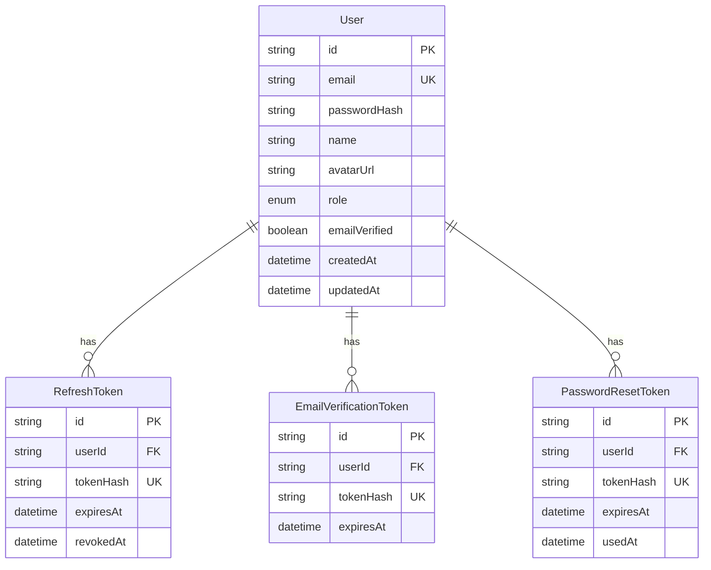

# Database Schema

Schema lives at [`apps/web/prisma/schema.prisma`](../apps/web/prisma/schema.prisma).
This document tracks the *full* intended schema across all phases — only the
Phase 1 tables exist today; the rest are added in the phase that needs them
(see [roadmap.md](./roadmap.md)) so the schema never has dead, unused tables.

## Phase 1 (implemented)

Notes:
- Only *hashes* of refresh/verification/reset tokens are stored — the raw
  value is only ever known by the user (in the URL/cookie), never persisted.
- `RefreshToken.revokedAt` implements rotation: a token is marked revoked the
  moment it's used to mint a new one, or on logout / password reset.

## Planned (added per-phase, not yet implemented)

- **Phase 2 — Gamification**: `XPLog`, `CoinLog`, `Level` (config), `Streak`,
  `Achievement`, `UserAchievement`, `DailyQuest`, `UserDailyQuest`,
  `WeeklyQuest`, `ShopItem`, `Purchase`, `Inventory`, `Notification`.
- **Phase 3/4 — Content**: `Subject`, `Module`, `Topic`, `Subtopic`, `Lesson`,
  `Question`, `QuestionChoice`, `QuestionTag`.
- **Phase 3/4 — Practice**: `PracticeSession`, `PracticeAnswer`.
- **Phase 5 — Practice tests**: `Test`, `TestSection`, `TestAttempt`,
  `TestAttemptAnswer`.
- **Phase 6 — Analytics**: `UserTopicMastery`, `AnalyticsSnapshot`.
- **Phase 7 — Social**: `Friendship`, `FriendRequest`, `Message`.
- **Phase 8 — Admin**: no new tables — gated by `User.role === ADMIN`.

## Conventions

- IDs: `cuid()` everywhere (sortable-ish, collision-resistant, no
  coordination needed — good fit for a single-writer Postgres setup).
- Table names are `snake_case` via `@@map`; Prisma model names stay
  `PascalCase`.
- Every foreign key has an index; cascading deletes are used for
  strictly-owned child rows (e.g. a user's tokens).
