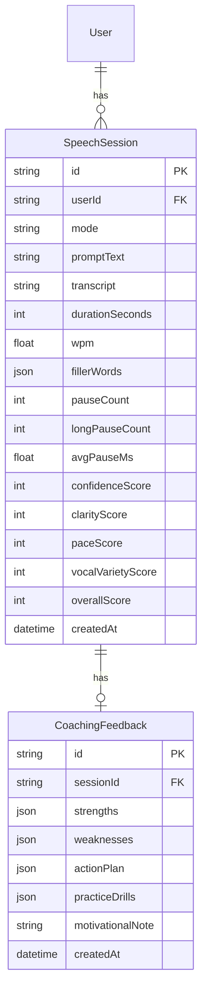
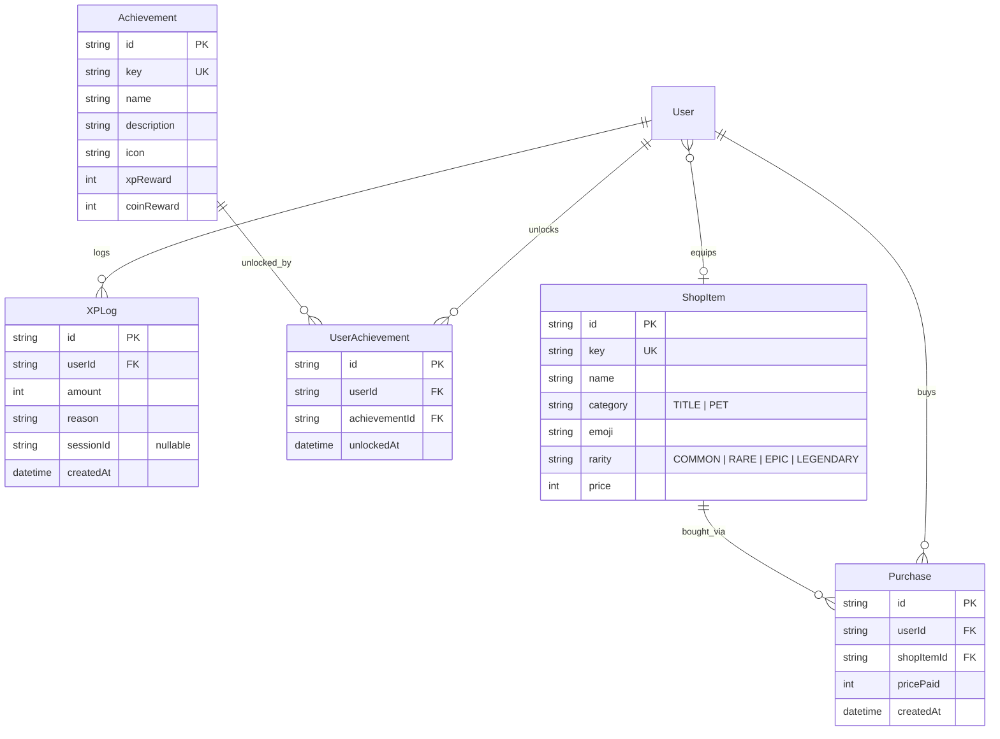

# Database Schema

Schema lives at [`apps/web/prisma/schema.prisma`](../apps/web/prisma/schema.prisma).

## Identity (unchanged from before the pivot)

`User`, `RefreshToken`, `EmailVerificationToken`, `PasswordResetToken` —
fully generic auth tables, no changes needed for the new product. See
[architecture.md](./architecture.md) for the auth model.

## Speech domain (Phase 1)

Notes:
- All scores are computed server-side by `src/lib/speech-metrics.ts` from
  the submitted transcript + timestamps — never trusted from the client
  directly, even though the client computes the same numbers live for
  in-progress display.
- `fillerWords` is stored as JSON (`[{ word, timestampMs }]`) rather than a
  child table — it's small, always read as a whole, and never queried
  independently of its session.
- `CoachingFeedback` is 1:1 with `SpeechSession`, kept as a separate table
  (rather than columns on `SpeechSession`) so a session can exist even if
  writing its feedback row fails for some reason — see `session.service.ts`.

## Gamification (Phase 4)

Notes:
- `User` gained `xp`, `coins`, `currentStreak`, `longestStreak`,
  `lastPracticeDate`, `equippedTitleId`, `equippedPetId` — level is always
  *derived* from `xp` (see `calculateLevel` in `src/lib/gamification.ts`),
  never stored, so it can't drift out of sync.
- `ShopItem.category` splits the catalog into `TITLE` (profile title
  badges) and `PET` (collectible companions) — the two are equipped into
  separate `User` columns/relations (`EquippedTitle` / `EquippedPet`), so a
  user can have one of each on at once. `emoji` is the item's "image"
  (zero-cost, no asset pipeline); `rarity` drives the store's visual
  styling and the price curve (common → first-week goal, legendary →
  10k-15k coins, a genuine long-term chase).
- `Achievement` and `ShopItem` are lazily upserted (and re-synced on every
  purchase/unlock) from static catalogs in code
  (`src/server/gamification/achievements.ts`, `.../shop-items.ts`) — the
  code is the source of truth, the DB row is a cache. `prisma/seed.ts` also
  pre-populates both catalogs as a convenience.
- `XPLog` is an audit trail (session completion, streak bonus, achievement
  unlocks each log a row) — not the balance itself; `User.xp`/`User.coins`
  are incremented directly and are what's actually read.

## Planned (added per-phase, not yet implemented)

- **Phase 2 — Practice modes**: mode metadata, `SpeechPrompt` (library of
  prompts per mode, or AI-generated on demand).
- **Phase 5 — Speech library**: `Technique` (Rule of Three, PREP, etc.),
  `ExampleSpeech` (curated excerpts, technique-focused).
- **Phase 6 — Daily exercises**: `Exercise`, `DailyExercise`.

## Conventions

Unchanged: `cuid()` IDs, `snake_case` table names via `@@map`, indexed
foreign keys, cascading deletes for strictly-owned child rows.
