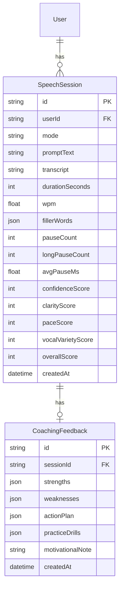

# Database Schema

Schema lives at [`apps/web/prisma/schema.prisma`](../apps/web/prisma/schema.prisma).

## Identity (unchanged from before the pivot)

`User`, `RefreshToken`, `EmailVerificationToken`, `PasswordResetToken` —
fully generic auth tables, no changes needed for the new product. See
[architecture.md](./architecture.md) for the auth model.

## Speech domain (Phase 1)

Notes:
- All scores are computed server-side by `src/lib/speech-metrics.ts` from
  the submitted transcript + timestamps — never trusted from the client
  directly, even though the client computes the same numbers live for
  in-progress display.
- `fillerWords` is stored as JSON (`[{ word, timestampMs }]`) rather than a
  child table — it's small, always read as a whole, and never queried
  independently of its session.
- `CoachingFeedback` is 1:1 with `SpeechSession`, kept as a separate table
  (rather than columns on `SpeechSession`) so a session can exist even if
  writing its feedback row fails for some reason — see `session.service.ts`.

## Planned (added per-phase, not yet implemented)

- **Phase 2 — Practice modes**: mode metadata, `SpeechPrompt` (library of
  prompts per mode, or AI-generated on demand).
- **Phase 4 — Gamification**: `XPLog`, `CoinLog`, `Streak`, `Achievement`,
  `UserAchievement`, `ShopItem`, `Purchase` — same pattern designed for the
  (abandoned) SAT platform, ported over conceptually.
- **Phase 5 — Speech library**: `Technique` (Rule of Three, PREP, etc.),
  `ExampleSpeech` (curated excerpts, technique-focused).
- **Phase 6 — Daily exercises**: `Exercise`, `DailyExercise`.

## Conventions

Unchanged: `cuid()` IDs, `snake_case` table names via `@@map`, indexed
foreign keys, cascading deletes for strictly-owned child rows.
